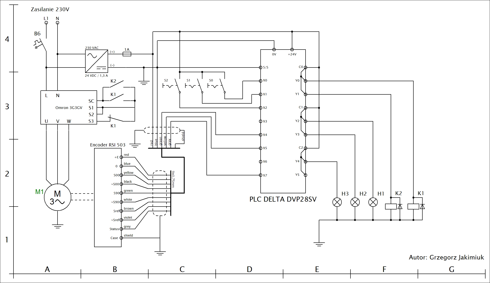
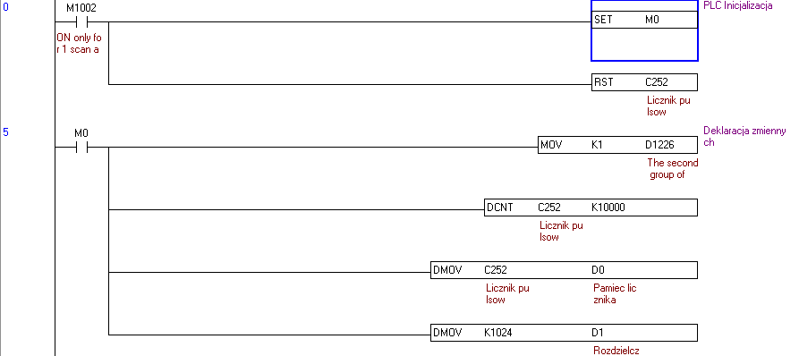
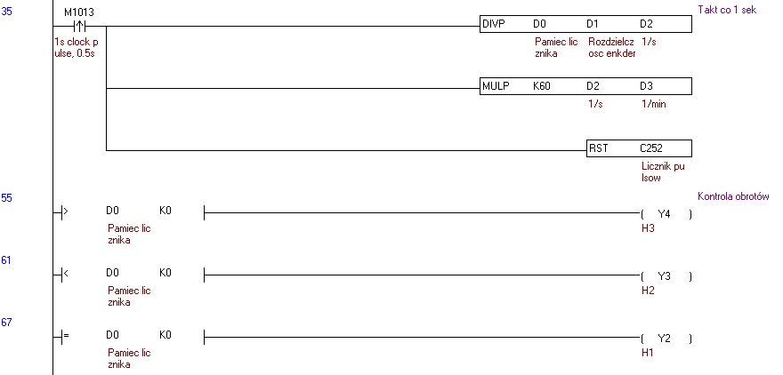
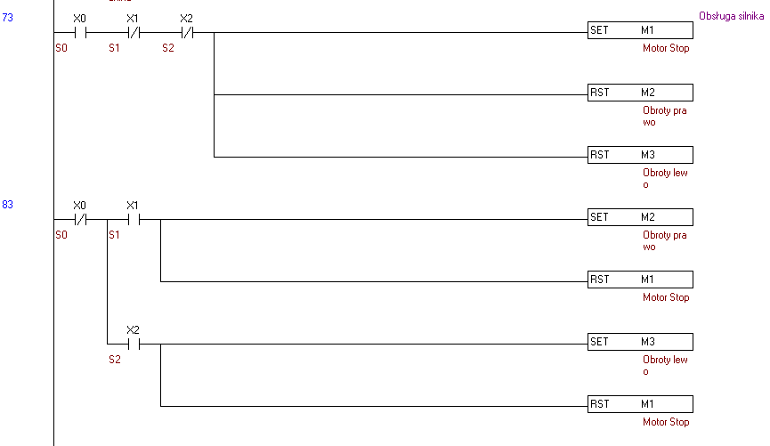
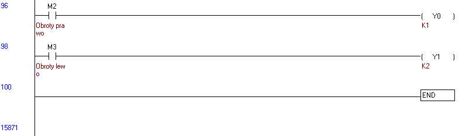

# PLC_Delta_Encoder

Projekt elektryczny realizujący układ napędowy przy pomocy silnika 3F w obu kierunkach obrotów. Zaimplementowano kontolę kierunku obrotów silnika realizowanego za sterownika PLC. 
W celu uzyskania możliwości nadawania obrotów w dwóch kierunkach oraz regulację prędkości obrotowej silnika wykorzystano falownik o mocy znamionowej 0.55kW, natomiast enkoder odpowiada za kontolę pracy silnika wysyłając sygnały do sterownika PLC. 
Tryby pracy silnika zostaną zasygnalizowane przy użyciu oświetlenia sygnalizacyjnego.

Środowisko:

•	Połączenie uzwojeń silnika w gwiazdę. 
•	Główne zasilanie 230V  
•	Zasilanie silnika z falownika. 
•	Brak zastosowanej przekładni mechanicznej. 
•	Logika sterowania realizowana jest z udziałem sterownika PLC. 
•	Dwukierunkowe praca silnika. 
•	Nadawanie obrotów lewo/prawo. 
•	Układ Start-Stop. 

Dane znamionowe silnika indukcyjnego:

•	Współczynnik mocy: 0.68 
•	Przekładnia wewnętrzna: 20:1 
•	Liczba obrotów na minutę: 1350 rpm 
•	Prąd znamionowy: 0.7A/0.4A 
•	Napięcie znamionowe: 230V/400V 

Wykorzystane rekwizyty:

•	Trzy przyciski monostabilne. 
•	Sterownik PLC z serii Delta DVP28SV. 
•	Falownik silnika 3x400V OMRON 3G3GV 0.55kW. 
•	Enkoder RSI 503. 
•	Zasilacz 24V o mocy 30W. 
•	Trzy żarówki 8W 24VDC. 
•	Dwa przekaźniki elektromagnetyczne 24V. 
•	Wyłącznik instalacyjny B6 

Oznaczenia rekwizytów na schemacie:

|Lp|	Indeks|	Opis|
| --- | --- | --- |
|1|	M1|	Silnik 3x400V|
|2|	U|	Falownik OMRON|
|3|	K1/K2|	Praca silnika do przodu / do tyłu|
|4|	S0|	Silnik Stop|
|5|	S1|	Silnik Start obroty w prawo|
|6|	S2|	Silnik Start obroty w lewo|
|7|	H1|	Sygnalizacja oborty w prawo|
|8|	H2|	Sygnalizacja oborty w lewo|
|9|	H3|	Postój|
|10|	PLC|	Sterownik PLC DVP28SV|
|11|	RSI 503|	Enkoder impulsatorowy|

Oznaczenie wejść/wyjść cyfrowych:

|Lp|	I/O|	Opis|
| --- | --- | --- |
|1|	X0|	Silnik Stop|
|2|	X1|	Silnik Start obroty w prawo|
|3|	X2|	Silnik Start obroty w lewo|
|4|	X4|	Enkoder sygnał S90|
|5|	X5|	Enkoder sygnał S00|
|6|	X7|	Kontrola enkodera|
|7|	Y0|	Silnik Start obroty w prawo|
|8|	Y1|	Silnik Start obroty w lewo|
|9|	Y2| 	Postój|
|10|	Y3|	Silnik Start obroty w prawo|
|8|	Y4|	Silnik Start obroty w lewo|
|10|	C1, C2, C3|	Potencjały wspólne|

Schemat elektryczny sterowania:

Sekcja inicjacyjna PLC:

Kontrola pulsów oraz obrotów:

Obsługa silnika:  

